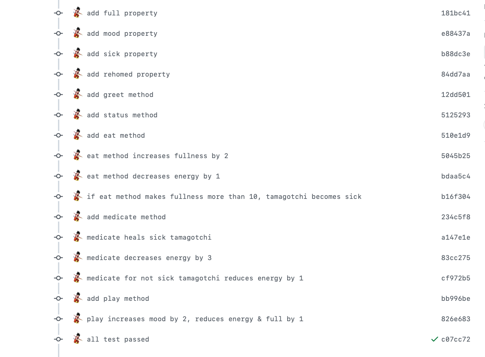
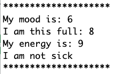

# Food and Pets

## Project setup

### Getting started

1. Fork and clone this repository.

1. Navigate to the cloned repository's directory on your command line. Then, run the following command:

```
npm install
```

This will install the libraries needed to run the tests.

1. Open up the repository in VSCode. Follow the instructions below to complete the Lab.

### Tests

To run the tests, you can run the following command from the command line. You will need to be in the root directory of your local directory.

```
npm test
```

This will run the test output once.

### Test watcher

If you'd like, you can have the tests run constantly. This means that each time you save your file, your tests will re-run. To do so, you can run the following:

```
npm run watch
```

Follow the on-screen prompts to exit out of the constant runner.

### Run tests individually

_After choosing a specific file to run,_ you can also specific which test you want to run, specifically. Add `.only` after either `test` or `describe` for the specific test you'd like to run.

```js
test.only("should return an array of everyone's name who is in the line, in order", () => {
```

This will either run the specific `test` or, in the case of adding `.only` to a `describe`, all of the tests for a specific function.

> **NOTE:** Don't forget to remove this after you get the test to pass!

### Run file

If you want to manually test out your file, you can do so by running the following command.

```
node [filename]
```

The output will be printed to your terminal.

## Include Descriptive Commit Messages Often



## Instructions

### Food

- Create a food class

- Attributes
  - name: string
  - daysToSpoil: number
  - fresh: boolean, default true
- Methods
  - prepare: console logs the `food name is being prepared`
  - isFresh: console logs a message if the food is fresh with the number of days left: `There are 3 days left before ice cream spoils`.
    - Else console logs a different message if the food is no longer fresh (0 or less days left)
    - `ice cream has spoiled.`
  - aDayPasses: decreases the `daysToSpoil` attribute by 1, calls the `isFresh` method to check freshness

Test your class by

- creating an instance
- running each method at least once

at the bottom of your file

### Tamagotchi

Create a virtual pet that can play, eat, sleep and more! Try to keep your pet happy or else it will be rehomed!

- Create a tamagotchi class

- Attributes
  - name: string
  - energy: number, default value 9
  - full: number, default value 8
  - mood: number, default value 6
  - sick: boolean, default false
  - rehomed: boolean, default false
- Methods

  - greet: Tamagotchi console logs `Hello, I'm <name>!`
  - status: Tamogotchi console logs energy, full, mood, and sick values (see below for sample message)
  - eat: increases fullness by two, decreases energy by 1,
    - if eat method makes fullness more than 10, tamagotchi becomes sick (sick = true)

- medicate:
  - if tamagotchi is sick - set full to 9 - decrease energy by 3
  - if tamagotchi is not sick
    - console log refusal to take medicine
      - reduce energy by 1
- play: increases mood by 2, reduces energy and full by 1,
  - will not play if tamagotchi is sick,
  - if asked to play when sick, reduce mood and energy by 1
  - will not play if mood is above 9, reduce energy by 2 and full by 1
  - will not play if energy is less than or equal to 3
    - console log "I am too tired to play" - reduce energy by 1
- sleep:
  - increases energy by 4 and decreases full by 3
- timePasses:
  - if tamagotchi is not sick - mood decreases by 2, fullness and energy decrease by 1
    -if tamagotchi is sick - mood decreases by 3, fullness and energy decrease by 2
- badGuardian
  - logs a message that the tamagotchi has been rehomed
  - if energy is less than or equal to 0, set rehomed to true
  - if mood is less than or equal to 0 set rehomed to true
  - if full is less than or equal to true set rehomed to true

Sample status message:



Test your class by

- creating an instance
- running each method at least once

### Bonus: Bad Foods Gone Bad

Some bad foods are going really bad! They no longer want to play nice. They want to fight each other!

- Create a new class `BadFood` that inherits from the `Food` class

- Attributes
  - name: (inherited) string
  - daysToSpoil:(inherited) start with 20 days, these will go down when the food is attacked (think of this like hit points)
  - fresh: boolean (when the food is knocked out (days to spoil is less than or equal to 0), change this property.) This food will have lost the battle if it is no longer fresh
  - weapons: an array of 3 objects that have hit points of 3, 4 an 5
- Methods
  - isFresh: (inherited) - use this to check the status of your bad food
  - prepare: overwrite this method so that instead it console logs a fight preparation method by taunting the other food `I am <name> and my calories are too high to count!` or `I am <name> and you are just a passing trend!`
  - fight: takes in an instance of a `BadFood`, selects a random fight method and decreases the hit points by the number from the selected fight method. Finally, console logs a message with both `daysToSpoil` properties
  `<pizza> is down <pizza.daysToSpoil> , but I am still up <donut.daysToSpoil> !`

Sample fight array for a donut

```js
[
  {
    name: "Sprinkle Spray",
    hitPoints: 3,
  },
  {
    name: "Icing Deluge",
    hitPoints: 4,
  },
  {
    name: "Sugar Shock",
    hitPoints: 5,
  },
];
```

Sample fight array for a pizza

```js
[
  {
    name: "Mouth Burn",
    hitPoints: 3,
  },
  {
    name: "Hot Pepper Storm",
    hitPoints: 4,
  },
  {
    name: "Cheese Grease",
    hitPoints: 5,
  },
];
```

Test your Bad Foods by:

- Creating two instances
- Have each one `prepare`
- Have each one `fight` once

#### Super Bonus

- Keep going and make this battle play out until someone is knocked out!

With the following methods, be sure to add some console logs so as a spectator you know how this fight is going down!

- Add a heal method that allows the food to increase daysToSpoil
- Add block method that allows the food to take 0 damage, no matter what
- Add an action selector method that randomly chooses between fight, heal and block
- Add a victory method that announces the victor
- Create a simple web app that allows you to play as a single or two player by using buttons and seeing status updates
